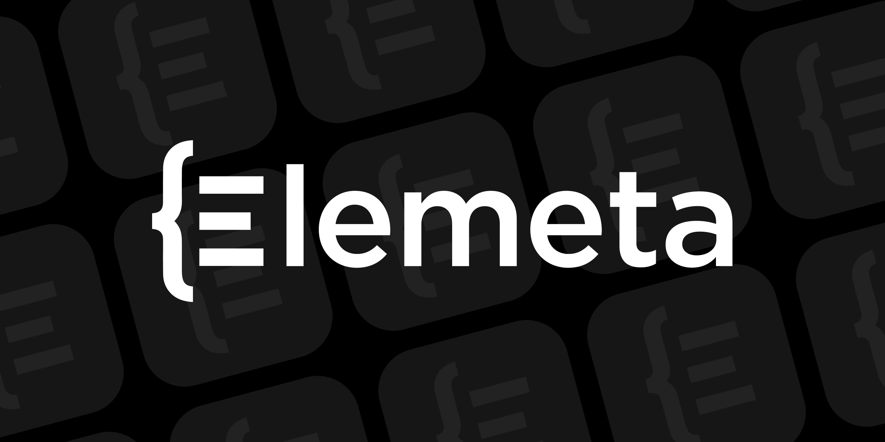

# Elemeta: Metafeature Extraction for Unstructured Data

[](https://github.com/superwise-ai/elemeta/actions/workflows/release.yaml)
[](https://pypi.org/project/elemeta/)
[](https://github.com/superwise-ai/elemeta/blob/main/LICENSE)
[](https://docs.elemeta.ai/getting_started.html)


Elemeta is an open-source library in Python for metafeature extraction. With it, you will be able to explore, monitor, and extract features from unstructured data through enriched tabular representations. It provides a straightforward Python API for metafeature extraction from unstructured data like text and images.

Key usage of Elemeta includes:

- Exploratory Data Analysis (EDA) - extract useful metafeature on unstructured data to analyze, investigate, and summarize the main characteristics and employ data visualization methods.
- Data and model monitoring - utilize structured ML monitoring techniques in addition to the typical latent embedding visualizations.
- Feature extraction - engineer alternative features to be utilized in simpler models such as decision trees.

## Getting Started

Get started with Elemeta by installing the Python library via pip

```bash
pip install elemeta
```

Once installed, there are a few example dataframes that can be used for testing the library.
You can find them in `elemeta.dataset.dateset`

```python
from elemeta.dataset.dataset import get_imdb_reviews
# Load existing dataframe
reviews = get_imdb_reviews()
```

After you have a dataset with the text column, you can start using the library with the following Python API:

```python
from elemeta.nlp.runners.metafeature_extractors_runner import MetafeatureExtractorsRunner

metafeature_extractors_runner = MetafeatureExtractorsRunner()
reviews = metafeature_extractors_runner.run_on_dataframe(dataframe=reviews, text_column='review')
reviews.show()
```


### Pandas DataFrames

Elemeta can enrich standard dataframe objects:

```python
from elemeta.nlp.runners.metafeature_extractors_runner import MetafeatureExtractorsRunner
import pandas as pd

df = pd.dataframe({"text": ["Hi I just met you, and this is crazy", "What does the fox say?", "I love robots"})
metafeature_extractors_runner = MetafeatureExtractorsRunner()
df_with_metafeatures = metafeature_extractors_runner.run_on_dataframe(dataframe=reviews, text_column="text")
```

### Strings

Elemeta can enrich specific strings:

```python
from elemeta.nlp.runners.metafeature_extractors_runner import MetafeatureExtractorsRunner

metafeature_extractors_runner = MetafeatureExtractorsRunner()
metafeature_extractors_runner.run("This is a text about how good life is :)")
```

## Documentation

- [Documentation homepage](https://docs.elemeta.ai/index.html)
- [Quickstart notebook](https://colab.research.google.com/github/superwise-ai/elemeta/blob/main/docs/notebooks/quick_start.ipynb)
- [Use cases](https://docs.elemeta.ai/use_cases/index.html)
- [API reference](https://docs.elemeta.ai/apidocs.html)

This package aims to help enrich non-tabular data (i.e. text:nlp pictures: image processing and so on).
Currently, we only support textual data, and we enrich it by extracting meta features (such as avg word length).

## Community

Elemeta is brand new, so we don't have a formal process for contributions just yet. If you have feedback or would like to contribute, just go ahead and post a [GitHub issue](https://github.com/superwise-ai/elemeta/issues)
