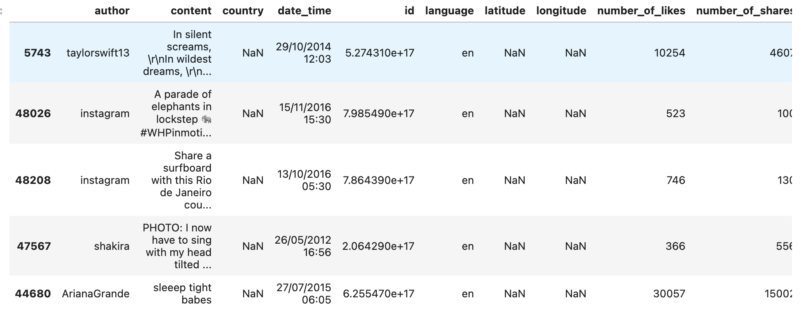

EDA
=============

| Here is a simple EDA example showing how generic information extraction can be valuable. This example illustrates how extracted metafeatures contain information that can be used to predict how many likes a tweet will receive.
| Let's start by enriching our tweets dataset again:

.. code-block:: python

    from elemeta.dataset.dataset import get_imdb_reviews
    reviews = get_imdb_reviews()[:2000]

Let’s create two RegexMatchCount - one for negative words and one for positive words:

.. code-block:: python

    from elemeta.nlp.extractors.high_level.regex_match_count import RegexMatchCount
    number_of_negative_words = RegexMatchCount(name="number_of_negative_words",regex="hate|sad|terrible|bad")
    number_of_positive_words = RegexMatchCount(name="number_of_positive_words",regex="love|wonderful|amazing|happy|good")

Now let's enrich the data:

.. code-block:: python

    from elemeta.nlp.metadata_extractor_runner import MetadataExtractorsRunner

    metadata_extractors_runner = MetadataExtractorsRunner()
    metadata_extractors_runner.add_metadata_extractor(number_of_negative_words)
    metadata_extractors_runner.add_metadata_extractor(number_of_positive_words)
    reviews_eda = metadata_extractors_runner.run_on_dataframe(dataframe=reviews,text_column='review')

Let’s look at the distribution of labels (number of likes).

.. code-block:: python

    sns.set_theme(style="darkgrid")
    sns.displot(
        reviews_eda, x="text_complexity", col="sentiment",
        binwidth=3, height=3, facet_kws=dict(margin_titles=True),
    )

.. image:: ../images/eda_text_complexity_histogram.png
        :width: 600
        :alt: histogram of text_length feature

We can clearly see a long right-tail distribution.

According to the below analysis, there is a clear correlation between tweet language and likes, since number_of_likes distribute differently between languages.

.. code::block:: python

    sns.displot(
        reviews_eda, x="word_count", col="sentiment",
        binwidth=3, height=3, facet_kws=dict(margin_titles=True),
    )

.. image:: ../images/eda_word_count_histogram.png
        :width: 600
        :alt: histogram of word_count feature

Apart from a few outliers, tweets with at least one emoji get more likes.

.. image:: ../images/eda_jointplot.png
        :width: 600
        :alt: joint ploat on number_of_positive_words,number_of_negative_words and sentiment

For a full working example
please use the following `Google Colab <https://colab.research.google.com/github/superwise-ai/elemeta/blob/main/docs/notebooks/EDA.ipynb>`_